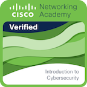
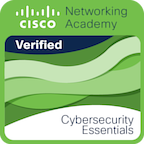

👋 Ciao mi chiamo Matteo Rossi, sono un Junior Wordpress Developer e un Full Stack Developer.

👀 I miei principali interessi sono l'informatica e praticare sport, in particolare nuoto e basket.

🌱 Attualmente sto studiando presso la Cisco Networking Academy per acquisire nuove competenze e conoscenze.

📫 Ecco come puoi contattarmi 👇
      
      - Email: rossimatteo32@gmail.com
      - Instagram: redlabpc
      - Telegram: @redlabpc32

---

## Progetti
https://redlabpc.com/

#### App Development
[Time For Percentage](https://play.google.com/store/apps/details?id=com.redlabpc.timeforpercentage)

#### Wordpress Project
[ISMAA-ONLINE](https://ismaa-online.org/)

[VE.RIS Immobiliare](https://verisimmobiliare.com/)

---

## Competenze
                

---

## Interessi

#### Sport
Sono un ragazzo molto sportivo, nuoto da ben 18 anni 🏊 e sono un appassionato di basket 🏀.

#### Cinema e Viaggi
🎥 e 🛫
<!---
Bla bla bla
--->
